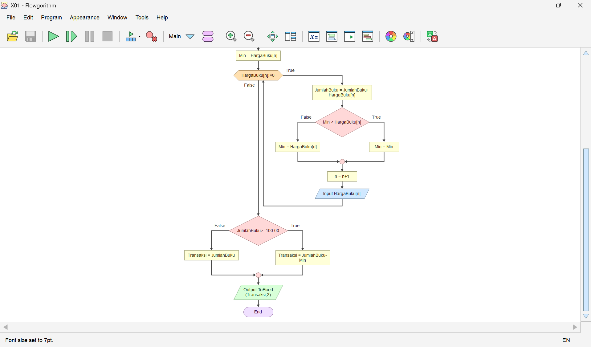

# Flowgorithm Visual Programming

Collection of coursework and projects developed using Flowgorithm and Java. This repository demonstrates algorithm design, logical problem-solving, and the translation of visual flowcharts into executable programs.

## Key Concepts

- Algorithm Design
- Conditional Logic
- Iteration & Loops
- Functions & Procedures
- Arrays
- Java Implementation

## Sample Flowchart

Example of a Flowgorithm assignment:

## Tech Stack

- Flowgorithm
- Java
- GitHub Actions

## Purpose

Academic coursework from the Visual Programming course at Del Institute of Technology.